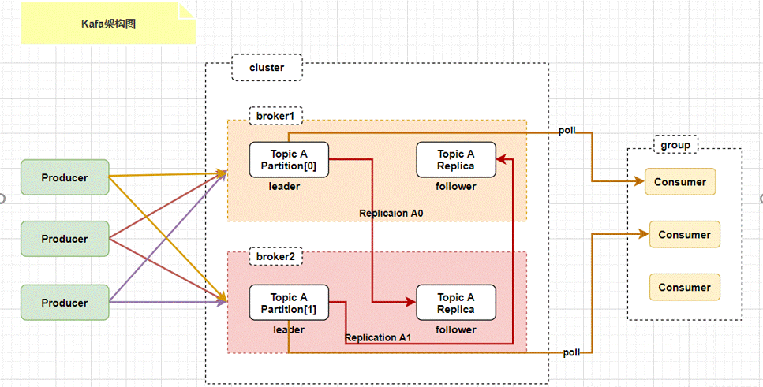

  <h1 align="center">Kafka分布式消息中间件</h1>
  

    <a href="README.md"><strong>English</strong></a> | <strong>简体中文</strong>
  

## 目录

- [仓库简介](#项目介绍)
- [前置条件](#前置条件)
- [镜像说明](#镜像说明)
- [获取帮助](#获取帮助)
- [如何贡献](#如何贡献)

## 项目介绍
‌[Apache Kafka‌](https://github.com/apache/kafka) Apache Kafka是一个分布式、支持分区（parition）、多副本（replica）的，基于Zookeeper协调的分布式消息系统。Kafka可以部署在本地和云中的裸机硬件、虚拟机和容器环境上，Kafka集群具有高度可扩展性和容错性。

**核心特性：**
1. 日志收集：Kafka可以收集各种服务的log，通过kafka以统一接口服务的方式开放给各种consumer，例如hadoop、Hbase、Solr等。
2. 度量指标：Kafka也经常用来记录运营监控数据。包括收集各种分布式应用的数据，生产各种操作的集中反馈，如报警和报告。
3. ‌流式处理：可以跟spark streaming和Flink集成使用。
4. 限流削峰：Kafka 可以用于互联网领域某一时刻请求特别多的情况下，可以把请求写入Kafka 中，避免直接请求后端程序导致服务崩溃。

**架构设计：**

本项目提供的开源镜像商品 [**Kafka分布式消息中间件**](https://marketplace.huaweicloud.com/hidden/contents/92e0c0d9-6a15-41a3-b71f-caf3a8de0d81#productid=OFFI1129684662074359808)，已预先安装 Kafka 软件及其相关运行环境，并提供部署模板。快来参照使用指南，轻松开启“开箱即用”的高效体验吧。

> **系统要求如下：**
> - CPU: 2GHz 或更高
> - RAM: 4GB 或更大
> - Disk: 至少 40GB

## 前置条件
[注册华为账号并开通华为云](https://support.huaweicloud.com/usermanual-account/account_id_001.html)

## 镜像说明

| 镜像规格                                                                                                                                 | 特性说明                                           | 备注 |
|--------------------------------------------------------------------------------------------------------------------------------------|------------------------------------------------| --- |
| [kafka3.8_EulerOS2.0](https://marketplace.huaweicloud.com/hidden/contents/92e0c0d9-6a15-41a3-b71f-caf3a8de0d81#productid=OFFI1129684662074359808) | 基于 鲲鹏服务器 + Huawei Cloud EulerOS 2.0 64bit 安装部署 |  |
| [kafka3.8_Ubuntu24](https://marketplace.huaweicloud.com/hidden/contents/92e0c0d9-6a15-41a3-b71f-caf3a8de0d81#productid=OFFI1129684602369187840) | 基于 鲲鹏服务器 + Ubuntu24.04 64bit 安装部署              |  |

## 获取帮助
- 更多问题可通过 [issue](https://github.com/HuaweiCloudDeveloper/kafka-image/issues) 或 华为云云商店指定商品的服务支持 与我们取得联系
- 其他开源镜像可看 [open-source-image-repos](https://github.com/HuaweiCloudDeveloper/open-source-image-repos)

## 如何贡献
- Fork 此存储库并提交合并请求
- 基于您的开源镜像信息同步更新 README.md
